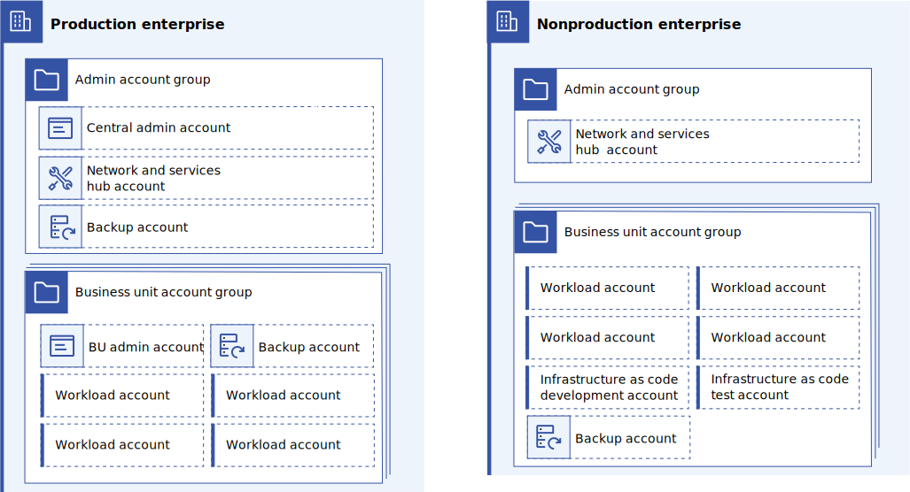

---

copyright:
  years: 2023, 2024
lastupdated: "2024-04-26"

subcollection: enterprise-account-architecture

keywords:

---

{{site.data.keyword.attribute-definition-list}}

# Planning your account structure
{: #account-structure}

A large organization needs to register for two IBM Cloud enterprises and then sets them up following this pattern.

{: caption="Figure 1. Enterprise account structure" caption-side="bottom"}

Each enterprise has a central account group to store administrative tools and enterprise-wide shared services. It also has a set of account groups for each business unit.

The following shows each type of account and its purpose:

| Account type | Quantity | Location | Purpose |
|--------------|----------|----------|---------|
| [Central administration](/docs/enterprise-account-architecture?topic=enterprise-account-architecture-admin-hub-account)    | 1 | Production administration account group. | Hosts infrastructure as code to manage both prod and nonprod enterprise configuration. |
| [Network and service hub](/docs/enterprise-account-architecture?topic=enterprise-account-architecture-hub-account) | 2 | Production and nonproduction administration account group. | Hosts centralized network resources, shared cloud tools, and any enterprise-wide shared custom services |
| [Business unit administration](/docs/enterprise-account-architecture?topic=enterprise-account-architecture-bu-admin-account)     | 1-25 | Production BU account groups | Hosts infrastructure as code to manage workload accounts and the workload account's applications and infrastructure. |
| [Workload](/docs/enterprise-account-architecture?topic=enterprise-account-architecture-infra-account)     | 2-500 | Production and nonproduction and BU account groups| Hosts shared infrastructure for hosting application workloads. Used in pairs |
| [Infrastructure as code development and test](/docs/enterprise-account-architecture?topic=enterprise-account-architecture-iac-account)      | 1+1 | Nonprod BU account groups | 1 Account to host cloud tools for infrastructure as code development and 1 for test deployments. |
| [Backup](/docs/enterprise-account-architecture?topic=enterprise-account-architecture-dr)      | 3-51 | Store backup and DR data | 1 for the Admin Account Group + 2 per BU (1 nonprod and 1 prod) |
{: caption="Table 1. Account purpose" caption-side="bottom"}

Improvements to Security and Compliance Center eliminate the need for an Security and Compliance Center deployment in the root of each enterprise.  Security and Compliance Center instances should be deployed in the administration accounts.
{: note}

## Rationale for separate production and nonproduction enterprises
{: #rationale-separate-enterprise }

A separate enterprise is used for production and nonproduction for several reasons:
- Separation of concerns. It is easier to reason about the overall system when nonproduction and production resources are clearly separated.
- Accounting. Ensures that R&D costs are separated from production costs that are required to be handled differently under GAAP and other accounting standards.
- Networking. Makes it possible to isolate the production and nonproduction networks and install rules that ensure that production applications don't accidentally depend on nonproduction resources.
- Scale. Doubles the maximum number of accounts and applications that can be managed.
- Alignment with IBM use. IBM Cloud uses this pattern internally, so it is well tested.

There are some limitations to using multiple enterprises, for example subscription commitments and credits are separately calculated for each enterprise at this time.

## User Access
{: #user-access}

In general, users should not be directly provisioned within this account structure. Instead, use [Federated identities](/docs/account?topic=account-federated_id) in combination with [trusted profiles](/docs/account?topic=account-create-trusted-profile) or [dynamic access groups](/docs/account?topic=account-rules) to grant access permissions in accounts as required.  Use of dynamic access groups or trusted profiles ensures cloud privileges stay in sync with the user's role as captured in the corporate directory and reduce the number of access policies that need to be managed.

## Scaling down
{: #scaling-down}

Not all enterprises will require maximum scale immediately. In this case there are some options to consider:

- Single enterprise

   Place both production and nonproduction in a single enterprise. In this case, create a top-level production and nonproduction account group that contains the remaining accounts. This makes it easier to separate production and nonproduction resources for accounting, compliance, security policy, and so on. A single enterprise cuts the maximum scalability of the overall solution in half and results in a single bill.

- Reduced number of business units

   Deploy only as many business unit account groups as required. At a minimum, an enterprise can use a single business unit account. Some enterprises might want to consolidate multiple real-world business units into a single business unit account. The single BU approach should be avoided at scale as it does not provide individual business unit autonomy or separation of concerns.

- Reduced number of workload accounts

   Deploy only as many workload accounts in each business unit as required. However, it is not recommended to consolidate production and nonproduction into a single account.
