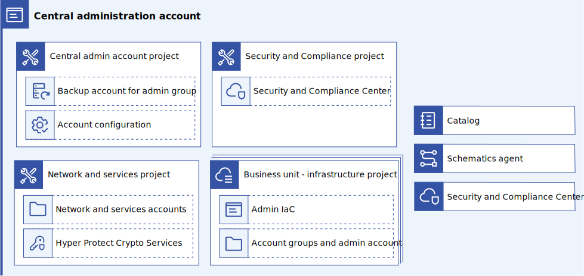

---

copyright:
  years: 2023
lastupdated: "2023-04-17"

subcollection: enterprise-account-architecture

keywords:

---

{{site.data.keyword.attribute-definition-list}}

# Central administration account
{: #admin-hub-account}

This administrative account centralizes the management of the deployable architectures that are needed to provision the enterprise account structure, the Security and Compliance Center, and the tools account across both development and production. The central administration account is used to bootstrap the remainder of the enterprise account structure.

{: caption="Figure 1. Central administration account" caption-side="bottom"}

The central administration account contains a catalog of deployable architectures that are deployed through IBM Cloud projects to manage the top-level accounts in both development and production to ensure both enterprises have nearly the same configuration and to provide centralized management. This account also holds the schematics agent to enable custom deployable architectures stored in corporate Git.

| Component | Quantity | Description |
|-----------|--------------|----|
| Security and Compliance Project | 1 |  Manages the infrastructure as code for deploying the Security and Compliance Center and its dependencies in the root account |
| Network and services project | 1 | Manages the infrastructure as code for deploying centralized networking and other common services into the central administration account |
| Business unit project | 1-25 | Manages the infrastructure as code for deploying a business unit account group, the business unit administration account, and the BU administration account contents |
| Private catalog | 1 | Used to host the approved deployable architectures for the projects in this account |
| Schematics agent | n (1+ per BU) | Used enable privately hosted custom deployable architectures in the private catalog |
| Centralized administration access groups | 1-5 | Used to provide access policies to the centralized DevOps team that manages this account |
{: caption="Table 1. Components" caption-side="bottom"}

The schematics agent, catalog, projects, and schematics workspaces must co-reside in a single account.
{: important}

## Administration authorization
{: #admin-auth}

Rather than authorizing users to deploy infrastructure as code directly, authorize project instances within the administration account to deploy resources and create child accounts. Authorizing projects to deploy resources and create child accounts ensures that only changes to the enterprise account structure and key shared infrastructure can be made through projects. Projects are thus subject to the governance provided by catalog onboarding and project configuration management. This helps implement the zero trust security best practice that is required by many compliance programs, including [Financial Services Cloud](/docs/framework-financial-services?topic=framework-financial-services-best-practices#best-practices-zero-trust).

## Rationale for centralized management across development and production
{: #rationale-for-central-proj}

Centralizing management of deployable architectures and their configuration into an admin account provides the following benefits:

- Single place to find IaC related to enterprise administration. The admin catalog ensures that only approved, tested, and compliant deployable architectures are available to the user. Using a single catalog allows administrators to find and use these deployable architectures easily.
- One catalog to publish IaC related to enterprise administration. Having a single catalog to maintain makes it easier to ensure that the correct set of deployable architectures is exposed and maintained. This includes ensuring that updates to deployable architectures are available and deployed in a timely fashion.
- Centralized access control and monitoring for key Enterprise infrastructure. Placing the catalogs and projects in a centralized account means that only a single set of access policies must be audited to ensure the correct (limited) set of users have access to manipulate this infrastructure.
- Use of projects with trusted profiles also ensures that credentials with the capability to manipulate this fundamental configuration are not directly accessible to users and thus cannot be misused.  Projects also ensure configuration governance, making it impossible for a single individual to modify key infrastructure.
- Only one schematics agent is needed.
