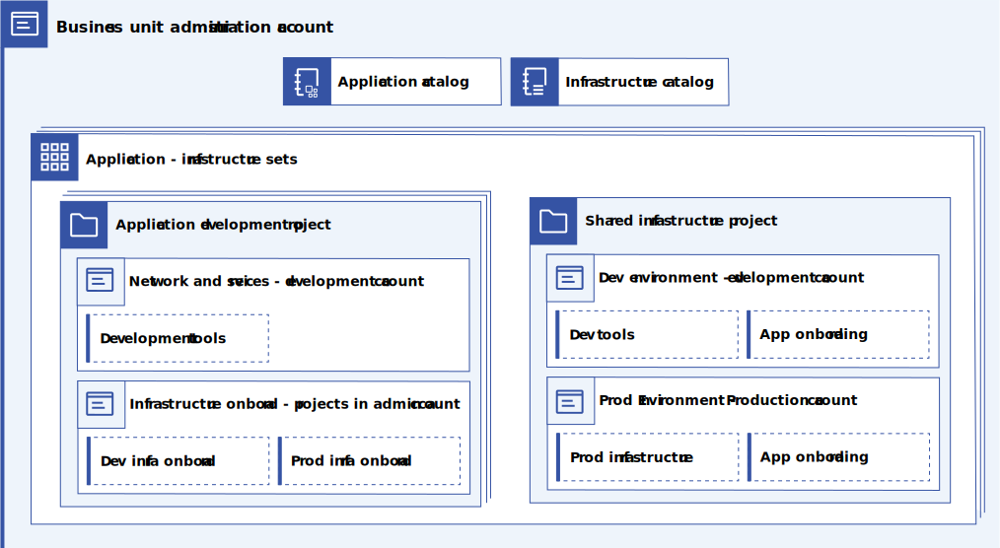
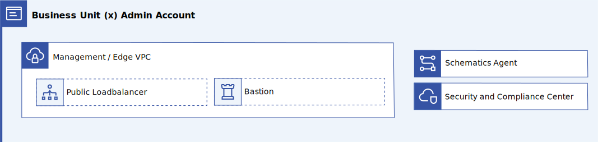
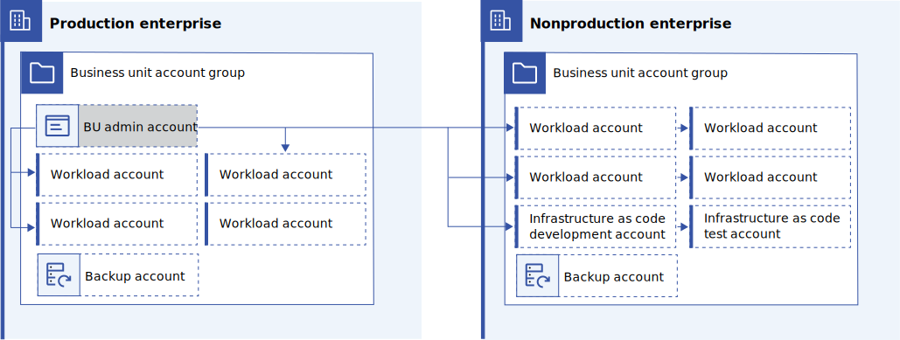

---

copyright:
  years: 2023, 2024
lastupdated: "2024-04-26"

subcollection: enterprise-account-architecture

keywords:

---

{{site.data.keyword.attribute-definition-list}}

# Business unit administration account
{: #bu-admin-account}

Each production business unit (BU) account group has a business unit administration account. This account enables BUs to self-administer their workload accounts and applications across development and production enterprises.
{: shortdesc}

Self-administration is constrained to the capabilities of the deployable architectures (infrastructure as code templates) provided in the application and infrastructure catalogs. These deployable architectures can include a subset of public offerings from {{site.data.keyword.cloud_notm}} and private offerings that are developed within the [IaC development accounts](/docs/enterprise-account-architecture?topic=enterprise-account-architecture-iac-account) and shared with the BU administration account.

{: caption="Figure 1. BU administration account infrastructure as code" caption-side="bottom"}

Deployable architectures in the infrastructure catalog enable workload accounts to be created and provisioned with the shared infrastructure needed to host applications in a secure and compliant manner.

| Component | Quantity | Description |
|-----------|--------------|----|
| Application catalog | 1 | Used to host the approved deployable architectures for the application projects in this BU. |
| Infrastructure catalog | 1 | Used to host the approved deployable architectures for the shared infrastructure projects in this BU. |
| Application development project | n | Manages the infrastructure as code for deploying application development resources such as Git repos, toolchains, container registries, evidence lockers and also requests namespaces, network egress rules, and so on within the shared infrastructure. The applications themselves are built and then deployed onto dev and prod shared infrastructure by using these tools. |
| Shared infrastructure project | n | Manages the infrastructure as code for deploying dev and prod workload accounts and the shared infrastructure within those accounts. |
| IaC Dev Project | 1 | Manages the infrastructure as code for deploying dev and test IaC accounts. These accounts are used for developing and testing deployable architectures. |
| Application - Infrastructure Sets | n | Conceptual grouping - groups a set of application projects and the project that deploys the infrastructure to host those applications. |
{: caption="Table 1. Components" caption-side="bottom"}

{: caption="Figure 2. BU administration account services" caption-side="bottom"}

Supporting the infrastructure as code elements in the BU administration account are Schematics workspaces and the Schematics agent. Schematics enables the use of deployable architectures that are stored in private Git repos that are hosted on the corporate network. This account also hosts the management and edge VPCs used in the VPC landing zone reference architecture if required by the BU.

| Component | Quantity | Description |
|-----------|--------------|----|
| Schematics agent | 1 | Used to enable privately hosted custom deployable architectures in the private catalog. |
| Schematics workspaces | n | Orchestrated by projects, used to deploy the deployable architectures, and store the terraform state. One workspace per configuration within each project. |
| Management/Edge VPC | 1 | Hosts the shared management and edge resources for the business unit. This can include public load balancers, bastion hosts, and custom management services. |
| Security and Compliance Center | 1 | Monitors the business uint account group in both production and nonproduction enterprises |
{: caption="Table 2. Components" caption-side="bottom"}

The schematics agent can be deployed in the Management/Edge VPC, but the agent should not be accessible from the public internet.

Additional Components not shown in the diagram:

| Component | Quantity | Description |
|-----------|--------------|----|
| Activity Tracker | 1 | Provides an audit trail for activity within the account |
| IBM Cloud Logging | 1 | Provides log monitoring for the infrastructure hosting the Schematics Agent |
| IBM Cloud Monitoring | 1 | Provides performance and error monitoring for the Schematics Agent |
| Event Notifications | 1 | Provides notifications for projects and the Security and Compliance Center |
| Automation trusted profile | 1 | Authorizes the central administration project to manage the infrastructure in this account. |
| Access groups and trusted profiles | n | A number of access groups and trusted profiles that are used to authorize BU operators to use catalogs and projects. |
{: caption="Table 3. Additional components" caption-side="bottom"}

## Security and Compliance Monitoring

Security and Compliance Center is most valuable when all relevant resources are scanned with an appropriate profile. Reasoning about resource coverage can be difficult in the face of independent Security and Compliance Center instances, complex scope configuration, and complex account structures.

Centralizing the Security and Compliance Center and configuring a broad scope that covers the business unit account group, makes reasoning about resource coverage easy while still allowing business unit autonomy over compliance objectives. This in turn, makes it easy to prove to internal and external auditors that all cloud resources within an audit scope are covered by appropriate Security and Compliance Center scans.

The instance of Security and Compliance Center deployed to the business unit administration account is configured to monitor all accounts in the business unit accoung group in both production and nonproduction enterprises ([docs](/docs/security-compliance?topic=security-compliance-scan-resources-cross-account)). It's also configured to send alerts with Event Notifications so that compliance problems are detected early and can be resolved rapidly.

## Management / Edge VPC
{: #management-edge-vpc}

The Financial Services Cloud reference architecture separates management and public internet access functions from the application hosting functions - see the [VPC reference architecture for IBM Cloud for Financial Services](/docs/framework-financial-services?topic=framework-financial-services-vpc-architecture-about) and the [Variation with edge or transit VPC for public internet access](/docs/framework-financial-services?topic=framework-financial-services-vpc-architecture-about#edge-vpc-architecture). These management and edge functions are centralized into the BU administration account to reduce cost and ease management and control.

## Infrastructure as code
{: #bu-iac}

The Business Unit administration account hosts the infrastructure as code and configuration to perform the initial setup and ongoing maintenance of the workload accounts for the Business Unit. Workload accounts are created and managed in a self-serve fashion that is limited to the deployable architectures made available within the private catalogs for the Business Unit.

{: caption="Figure 3. Accounts managed from the BU Administration Account" caption-side="bottom"}

## Authorization
{: #authorization}

Rather than authorizing BU account users to deploy infrastructure as code directly, authorize [IBM Cloud project](/docs/secure-enterprise?topic=secure-enterprise-understanding-projects) instances within the business unit administration account to deploy resources and create child accounts. As projects deploy only approved architectures from the catalog, this ensures changes to workload accounts are subject to the governance provided by catalog onboarding and project configuration management.

This authorization model helps implement the zero trust security best practices that are required by many compliance programs, including [Financial Services Cloud](/docs/framework-financial-services?topic=framework-financial-services-best-practices#best-practices-zero-trust).

Users should not be granted privileges to modify resources in the workload accounts.
{: note}

As is [best practice](/docs/account?topic=account-account_setup#how_access), users should be granted access to projects, catalogs, and observability tools within the account through access groups, trusted profiles, or both. An additional level of security can be obtained by ensuring that users normally do not have access to deploy changes to production. Users needing production deployment privileges must switch to a production trusted profile (which has privileges to deploy to production through projects), greatly reducing the opportunity for mistakes that can affect production. Production trusted profiles should be configured with a short session duration and with privileges only for production deployments, eliminating the possibility that users will simply use this profile all the time.

### Additional protection for production
{: #additional-considerations}

Given that projects within the BU admin account will have access to both nonproduction and production artifacts, it is theoretically possible that experimental changes or nonproduction artifacts might inadvertently be deployed to production.

This concern can be mitigated by limiting users within the BU admin account read-only access to project configurations that target production.  Then a trusted profile with access to perform deployments to production and a limited session duration can be provided to users trusted to deploy to production.  In this way, a deliberate switch to the production deployment trusted profile is required, making it impossible to accidentally change production.

In addition, a use a naming convention where accounts, trusted profiles, configurations, and key resources are named with an environment prefix or suffix. The naming convention makes it possible to see at a glance what resources are being proposed to deploy where during configuration and during the project approval flow. Project environments should also be used to group configurations that target production and to provide production access credentials, further ensuring that mistakes cannot be made.

## Rationale for centralized infrastructure as code management
{: #rational-central-iac}

Centralizing management of deployable architectures and their configuration into a production administration account for each BU provides the following benefits:

- BU operators can manage their own workloads within the constraints that are imposed by the centralized organization.

   The application and infrastructure catalogs ensure that only approved, tested, and compliant deployable architectures are available. Using two catalogs makes it easy to set an IAM policy such that users have access to the correct set of deployable architectures according to their roles. For example, DevOps users get access to infrastructure and application developers get access to application development tools.

- Centralized access control and monitoring for the BU

   Placing the catalogs and projects in a centralized account makes it easier to ensure that the principle of least privilege is applied. Use of projects also ensures that credentials with the capability to manipulate applications and infrastructure are not accessible to users and thus cannot be misused. Finally, keeping these related projects in the BU account makes it easy to monitor deployments and ensure that the infrastructure is up to date and compliant.

- Ensures that development, test, and production are aligned.

   Using a single project across nonproduction and production makes it possible to align development and test environments with production environments. The single project helps reduce the chance of defects that are related to environmental differences while providing control to the team over testing new deployable architecture versions in different environments. It also ensures that the lifecycle of these resources is properly managed across all environments. For example, if a project is no longer needed, it is easy to clean up all resources across nonproduction and production environments.

- Allows all project resources to be tracked for accounting and configuration management.

   Using a single project across nonproduction and production ensures that all project (or application) resources are tracked and allocated to the project. Projects enforce resource tagging and track resource providence, approvals, and so on. This ensures that accounting and configuration management needs are covered.

- Only one schematics agent is needed per BU.
