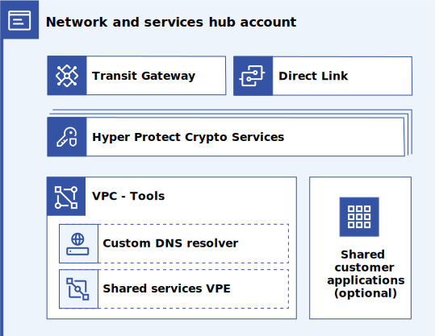

---

copyright:
  years: 2023
lastupdated: "2023-06-29"

subcollection: enterprise-account-architecture

keywords:

---

{{site.data.keyword.attribute-definition-list}}

# Network and services hub account
{: #hub-account}

The network and services hub account provides a location for centralized network services, centralized security services, and any customer services that also require centralization.
{: shortdesc}

{: caption="Figure 1. Network and services hub account" caption-side="bottom"}

A network and services hub account is created in both development and production environments.

| Component | Quantity | Description |
|-----------|--------------|----|
| Transit Gateway | 1 | Provides network connectivity across all VPCs in the enterprise |
| Direct Link | 1-4 | Connects the enterprise to the corporate network. Up to 4 instances used if maximum redundancy required |
| Hyper Protect Crypto Services | 1-2 | Provides key management services to applications across the enterprise. Requires a service-to-service policy for each application. 2 instances required only if scale demands. |
| VPE - VPC | 1 | Provides private networking for IBM Cloud services. VPEs are provisioned in this VPC for all IBM Cloud services that are used in the enterprise. A custom DNS resolver enables DNS resolution for the VPEs. |
| Shared customer applications | n | Customer applications that must be centralized can be deployed here |
| Trusted profile | 1 | Authorizes management of this account by a project in the central administration account |
| Access groups | n | Small number of access groups to enable a centralized DevOps team to monitor and manage the account |
{: caption="Table 1. Components" caption-side="bottom"}

## Rationale for centralizing shared resources
{: #rationale}

Some network infrastructure and certain key resources are costly and require lengthly lead times and manual labor to set up. These resources benefit from enterprise-level centralization to avoid the costs and delays that would be incurred if deployed at an account level. These needs must be balanced against the desire for separation of concerns and blast radius reduction.

## Hyper Protect Crypto Services
{: #hpcs}

Hyper Protect Crypto Services (HPCS) instances are centrally located so they can be shared across the enterprise to reduce costs. Two instances are required to reach the scale requirements of this recommendation. Smaller organizations can start with a single instance and grow as needed. When services are provisioned in workload accounts, service to service policies (in the network and services hub account) enable those services to access HPCS.

## Centralized network services
{: #central-network}

A Transit Gateway in the network and services hub account connects all VPCs in the environment to each other with private networking. This unified private network is then linked to the corporate network through Direct Link. Network isolation is achieved within this flat network through VPC security groups and network ACLs. For more detailed recommendations on securely configuring VPC networking, see [Financial Services Cloud Networking](/docs/framework-financial-services?topic=framework-financial-services-vpc-architecture-connectivity-overview).

Make sure that VPC network addresses do not overlap across the enterprise.
{: note}

A firewall might be deployed in this account or within the corporate network to ensure that traffic from the production environment cannot reach the development environment.

Virtual Private Endpoints (VPE) for shared IBM Cloud services are configured within a VPC in the network and services hub account as VPEs might be attached at only one point in the flat address space. This VPC also includes a custom DNS resolver to ensure the centralized VPEs are properly DNS resolved from all VPCs in the environment.

Some details on how VPEs should be centralized are still being worked out.  This document will be updated when that information is available.
{: note}
