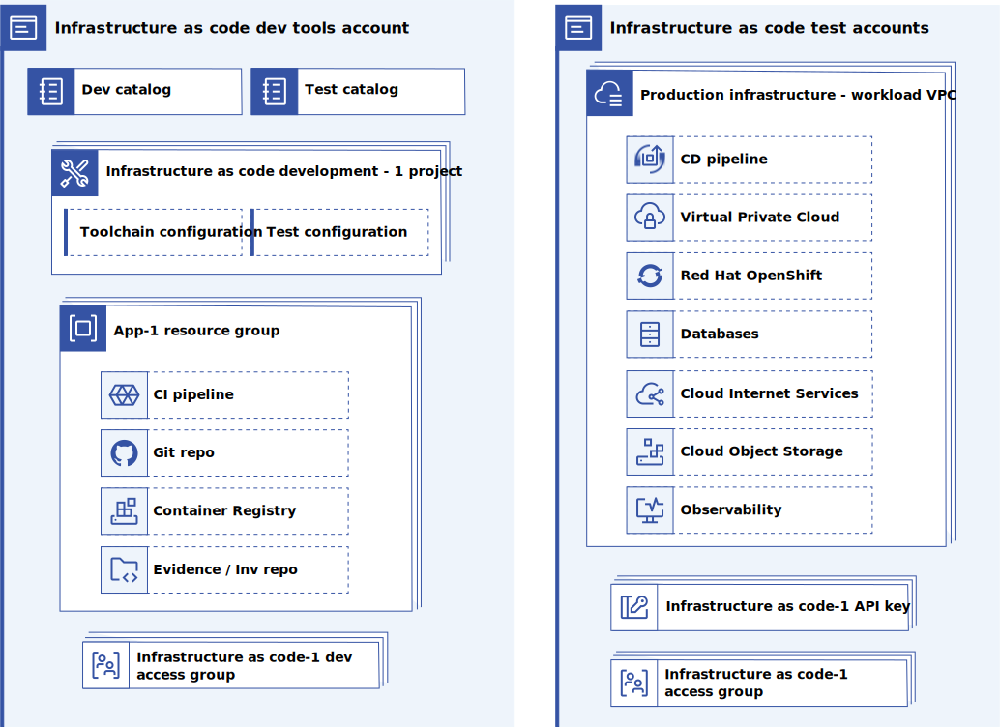

---

copyright:
  years: 2023
lastupdated: "2023-10-15"

subcollection: enterprise-account-architecture

keywords:

---

{{site.data.keyword.attribute-definition-list}}

# Infrastructure as code development accounts
{: #iac-account}

In addition to consuming existing infrastructure as code to create hub and workload accounts, organizations will need a set of accounts to develop, extend, and maintain any custom infrastructure as code.

{: caption="Figure 1. Infrastructure as code development accounts" caption-side="bottom"}

One account is used for deployable architecture development. This account contains infrastructure as code development tools such as toolchains, Git repos, and catalogs of infrastructure as code modules for use in development. It also includes a test catalog where test versions of the infrastructure as code are published to be used in a test project.

| Component | Quantity | Description |
|-----------|--------------|----|
| Development catalog | 1 | Used to host the approved deployable architectures for the infrastructure as code development projects in this account. |
| Test catalog | 1 | Used to host the versions of deployable architectures under test. |
| Infrastructure as code development project | n | Manages the infrastructure as code for deploying infrastructure as code development resources such as Git repos, toolchains, container registries, and evidence lockers. The terraform is then published into a test catalog for deployment testing. The project also contains a configuration that deploys the infrastructure as code into the test account from the test catalog. |
| Development resource group | n | Contains the infrastructure as code development resources such as Git repos, toolchains, container registries, and evidence lockers for a single infrastructure as code development project |
| Schematics agent | 1 | Used enable privately hosted custom deployable architectures in the private catalog. |
| Schematics workspaces | n | Orchestrated by projects, used to deploy the deployable architectures and store terraform state. One workspace per configuration within each project. |
{: caption="Table 1. IaC Tools Components" caption-side="bottom"}

A second account is used for test deployments of the new infrastructure as code versions.

| Component | Quantity | Description |
|-----------|--------------|----|
| Workload VPC | n | An example of what might be deployed for test by the infrastructure as code under development. |
| Infrastructure as code trusted profile | n | Authorizes management of this account by an infrastructure as code development project |
| Test resource group | n | A resource group in which to deploy test resources for each cleanup.
| Infrastructure as code access group | n | Access groups to enable infrastructure as code development teams to test the deployed infrastructure as code. Provides access to a test resource group (or groups if required by the deployable architecture). |
{: caption="Table 2. IaC test components" caption-side="bottom"}

## Sharing deployable architectures
{: #share-da}

After a deployable architecture version is ready for use, it can be shared with the central administration account and BU administration accounts for consumption. Leverage the catalog's ability to [share private offerings](/docs/account?topic=account-catalog-share&interface=ui) to make the deployable architectures available within the enterprise.
