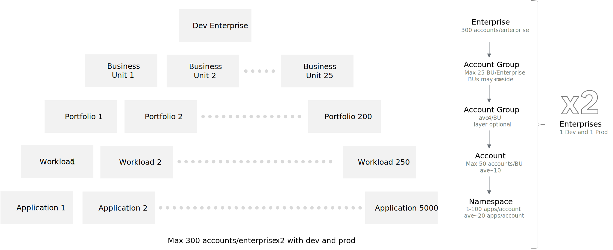

---

copyright:
  years: 2023
lastupdated: "2023-03-29"

subcollection: enterprise-account-architecture

keywords:

---

{{site.data.keyword.attribute-definition-list}}

# Volumetric analysis
{: #volumetric-analysis}

To accommodate [maximum scaling requirements](/docs/enterprise-account-architecture?topic=enterprise-account-architecture-account-reqs) while remaining within IBM Cloud limits, you can group multiple IBM Cloud accounts within IBM Cloud enterprises to enable consolidated management and billing.
{: shortdesc}

Use of two enterprise accounts are recommended to separate development and production resources for operational, accounting, and scaling benefits. Within each account, applications and shared infrastructure are placed within a hierarchy of account groups that represent business units and optional subgroups. These subgroups can be used to represent portfolios or other parts of a business unit org tree.

{: caption="Figure 1. Volumetric Analysis: how basic account structure scales to required number of applications" caption-side="bottom"}

The two enterprise account model increases separation between the development and production environments, enables separate billing and accounting, and improves scale. However, it increases complexity and requires duplication of some work, for example, setting up enterprises and configuring certain shared services. This duplication of work is largely mitigated through automation.

Business unit account groups do not have to map directly to an enterprise's internal org structure. If needed, two or more smaller BUs can be placed in a single BU account group, or large BUs can be split into two. Beneath the BU layer, an optional layer of "portfolio" account groups can be used to further separate workloads and accounts to align with organizational needs.

IBM Cloud has a limit of 300 account groups and 300 total accounts per enterprise.
{: note}
