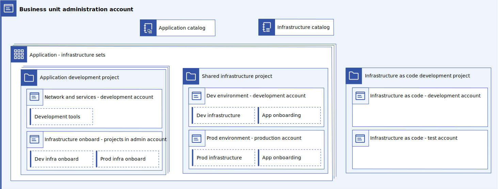

---

copyright:
  years: 2023
lastupdated: "2023-04-10"

subcollection: enterprise-account-architecture

keywords:

---

{{site.data.keyword.attribute-definition-list}}

# Enterprise architecture
{: #about}

Large enterprises that allow an account structure, cross account networking, resource deployment, and billing to develop organically run the risk of encountering governance, scaling, security, and accounting issues. This document provides a recommendation for how to address these concerns across accounts so that a robust, compliant, and scalable solution can be achieved.
{: shortdesc}

This recommendation extends and complements the account and resource level guidance that is found in the [IBM Cloud Framework for Financial Services](/docs/framework-financial-services?topic=framework-financial-services-about) and other IBM Cloud best practices such as:

- [Best practices for setting up an enterprise](/docs/secure-enterprise?topic=secure-enterprise-enterprise-best-practices)
- [Best practices for organizing resources and assigning access](/docs/account?topic=account-account_setup)
- [Best practices for organizing users, teams, and applications](/docs/solution-tutorials?topic=solution-tutorials-users-teams-applications)
- [Best practices for working with Security and Compliance Center](/docs/security-compliance?topic=security-compliance-best-practices)
- [Best practices for billing and usage](/docs/billing-usage?topic=billing-usage-best-practices)
- [Advanced networking for IBM Cloud VPC](https://www.ibm.com/cloud/architecture/content/course/advanced-networking-for-vpc){: external}

## Large enterprise requirements
{: #account-reqs}

Large enterprises often have similar requirements for scale, security infrastructure, and governance.

The following table includes some of these common requirements that are targeted by the architecture that is covered in this white paper.

| Domain | Requirement | Detail |
| ----------- | ----------- | ----------- |
| Resource Scalability | Compute | Up to 40k hosts, 160k vCPUs |
| | Containers | Up to 20k Containers |
| | Storage | Up to 50 PB (main) & 30 PB (backup) |
| | Applications | Up to 5,000 apps |
| | Growth | Support 20% Y/Y growth |
| Organization Scalability | Business Units | Up to 25 |
| | Portfolios | Up to 250 |
| | Users | Up to 100k |
| Security | Network security and enterprise integration | Multi-vendor VNF integration
| | Segmentation and isolation | Zero trust: deny first, allow what you must |
| | Onboarding, offboarding, or consolidation of units and teams | |
| | Network intelligence | Enterprise scale, virtualized firewalls |
| | Data protection | Encryption, BYOK, audit, exfil prevention |
| Infrastructure | Common services that are shared across teams and accounts| |
| |Common network connectivity to on-premises | |
| |Centrally managed enterprise transit| |
| |Unified usage reporting and billing| |
| |Quotas by unit, team, apps| |
| | Application migration and restructuring | |
| |Shared logging facility| |
| Governance | Templated deployment support | Automated deployment of approved infra patterns |
| | Enterprise policy | |
| | Role inheritance across enterprise| |
| | Maximize cost effectiveness| |
| | Integration with governance tools| Includes security advisor |
| Compliance | Financial Services Cloud | Compliant by default, audited, shift left |
| | SOC2, GDPR, and so on | Compliance coverage |
{: caption="Table 1. Common Requirements for large enterprises" caption-side="bottom"}

## Volumetric analysis
{: #volumetric-analysis}

To accommodate [maximum scaling requirements](/docs/enterprise-account-architecture?topic=enterprise-account-architecture-account-reqs) while remaining within IBM Cloud limits, you can group multiple IBM Cloud accounts within IBM Cloud enterprises to enable consolidated management and billing.

Use of two enterprises are recommended to separate nonproduction and production resources for operational, accounting, and scaling benefits. Within each enterprise, applications and shared infrastructure are placed within a hierarchy of account groups that represent business units and optional subgroups. These subgroups can be used to represent portfolios or other parts of a business unit org tree.

{: caption="Figure 1. Volumetric Analysis: how basic account structure scales to required number of applications" caption-side="bottom"}

The two enterprise model increases separation between the nonproduction and production environments, enables separate billing and accounting, and improves scale. However, it increases complexity and requires duplication of some work, for example, setting up enterprises and configuring certain shared services. This duplication of work is largely mitigated through automation.

Business unit account groups do not have to map directly to an enterprise's internal org structure. If needed, two or more smaller BUs can be placed in a single BU account group, or large BUs can be split into two. Beneath the BU layer, an optional layer of "portfolio" account groups can be used to further separate workloads and accounts to align with organizational needs.

IBM Cloud has a limit of 300 account groups and 300 total accounts per enterprise.
{: note}

## Principles
{: #principles}

This recommendation uses the following key principles to obtain scale while optimizing for compliance, cost, and operational efficiencies.

- Manage cloud as code (compliance and ops optimization)
- Separate development and production environments (general compliance)
- Hub and spoke (networking optimization)
- Avoid duplication of shared tools (cost and ops optimization)
- Use shared infrastructure for application workloads (cost and ops optimization)
- Separate workload and management (compliance)
- Work within IBM Cloud operating limits and constraints

### Cloud as code
{: #iac}

A key part of this recommendation is to do all cloud setup and configuration as code - that is, automate everything from application infrastructure to account creation, to compliance monitoring. Automating everything allows the enterprise to ensure scale, compliance, security, and so on, in a repeatable and easily evolvable fashion. IBM Cloud provides a number of deployable architectures in the IBM Cloud catalog that can be used to automate these recommendations with minimal effort. These pre-made solutions can also be customized or extended to match the needs of the enterprise.

Managing infrastructure as code at scale requires more than just Terraform in a Git repo. Infrastructure as code is the DNA of an enterprise-wide cloud solution because it must be subject to both governance and management. Infrastructure as code ensures that only validated, compliant, and approved code is deployed. You can also track how deployments correspond to internal projects, teams, cost centers, and more.

IBM Cloud provides a number of tools to assist with this process. The IBM Cloud catalog allows an enterprise to advertise approved IaC solutions to users across the cloud. [IBM Cloud projects](/docs/secure-enterprise?topic=secure-enterprise-understanding-projects) allow an enterprise to ensure that only approved IaC is deployed and to track how the resulting resources correspond to projects, teams, and cost centers.

#### Related controls in IBM Cloud Framework for Financial Services
{: #iac-controls}

The following [IBM Cloud Framework for Financial Services controls](/docs/framework-financial-services?topic=framework-financial-services-about#framework-control-requirements) are most related to this guidance. However, in addition to following the guidance here, do your own due diligence to ensure you meet the requirements.

| Family | Control |
|--------|---------|
| Configuration Management (CM) | [CM-2 Baseline Configuration](/docs/framework-financial-services-controls?topic=framework-financial-services-controls-cm-2) |
| | [CM-2 (2) Automation Support for Accuracy / Currency](/docs/framework-financial-services-controls?topic=framework-financial-services-controls-cm-2.2) |
| | [CM-3 Configuration Change Control](/docs/framework-financial-services-controls?topic=framework-financial-services-controls-cm-3) |
| Access Control (AC) | [AC-5 Separation of Duties](/docs/framework-financial-services-controls?topic=framework-financial-services-controls-ac-5) |
{: caption="Table 2. IBM Cloud Framework for Financial Services controls" caption-side="bottom"}

### Separate development and production
{: #dev-and-prod}

Development environments must be separated from production environments as they have different accounting, resource utilization, access, availability, networking, and compliance requirements. However, at the same time development environments should be kept in sync with production environments so that users testing in development can be confident that the application will behave similarly in production.

This recommendation creates a clean separation between development and production environments, but uses infrastructure as code to ensure that development and production are aligned.

#### Related controls in IBM Cloud Framework for Financial Services
{: #dev-and-prod-controls}

The following [IBM Cloud Framework for Financial Services controls](/docs/framework-financial-services?topic=framework-financial-services-about#framework-control-requirements) are most related to this guidance. However, in addition to following the guidance here, do your own due diligence to ensure you meet the requirements.

| Family              | Control                                           |
|---------------------|---------------------------------------------------|
| Configuration Management (CM) | [CM-3 (2) Configuration Change Control &#124; Testing, Validation, and Documentation Of Changes](/docs/framework-financial-services-controls?topic=framework-financial-services-controls-cm-3.2) |
| | [CM-4 (1) Impact Analyses &#124; Separate Test Environments](/docs/framework-financial-services-controls?topic=framework-financial-services-controls-cm-4.1) |
| System and Services Acquisition (SA) | [SA-10 Developer Configuration Management](/docs/framework-financial-services-controls?topic=framework-financial-services-controls-sa-10) |
| | [SA-15 (9) Development Process, Standards, and Tools &#124; Use of Live Data](/docs/framework-financial-services-controls?topic=framework-financial-services-controls-sa-15.9) |
| System and Communications Protection (SC) | [SC-2 Application Partitioning](/docs/framework-financial-services-controls?topic=framework-financial-services-controls-sc-2) |
| | [SC-3 Security Function Isolation](/docs/framework-financial-services-controls?topic=framework-financial-services-controls-sc-3) |
{: caption="Table 3. IBM Cloud Framework for Financial Services controls" caption-side="bottom"}

### Hub and spoke model
{: #hub-and-spoke}

In cloud, it is common to talk about using a hub and spoke model for networking. In this model, a centralized network hub links many spoke networks (VPCs) together. A centralized hub is typically used to reduce costs and increase scale while still allowing private network connectivity within the cloud.

In this recommendation, we also generalize this hub and spoke pattern, applying it to several different areas of concern including networking, managing infrastructure as code, secrets, shared services, and more.

### Shared application infrastructure
{: #shared-infrastructure}

Creating secure, compliant, robust, and scalable application infrastructure can be difficult to set up and costly to maintain. VMs or clusters must be deployed, logging and monitoring configured, firewalls and vulnerability checks enabled, and all of this must be monitored and kept up to date. In addition, this infrastructure must be scaled to accommodate application burst loads and as a result some aspects of the infrastructure are underutilized most of the time.

Standardizing application infrastructure where possible, and then hosting many applications on the same infrastructure, is essential to reduce operations costs. This set up allows the infrastructure to be better utilized and shares the operations cost across many applications. This also makes it practical to use infrastructure as code to deploy many copies of the infrastructure, amortizing the development and maintenance cost of that infrastructure as code across potentially thousands of applications.

As shown in the volumetric analysis, from 1-100 applications should be hosted per account on this shared infrastructure with an average of perhaps 10-20 applications per account. With hundreds of accounts (some that are designated for development and test and some that are designated for production workloads), this model can support many thousands of applications and their development.

A good starting point for developing the standardized application hosting infrastructure is IBM Cloud's VPC landing zone deployable architecture. This IBM Cloud for Financial Services compliant solution sets up everything that is needed to host VM or Container based applications in a fully secure and compliant fashion. Also, the deployable architecture is supported and maintained by IBM. As new compliance requirements arrive or vulnerabilities are discovered, the solution is updated to maintain security and compliance.

### Separate management from workload
{: #mgmt-workload}

In the IBM Cloud Framework for Financial Services [reference architecture](/docs/framework-financial-services?topic=framework-financial-services-vpc-architecture-about), management workloads are separated from application workloads to support the different access models, data privacy requirements, network access requirements, and so on. Because these principles apply more broadly than just in the Financial Services industry, they have been applied in this general recommendation.

#### Related controls in IBM Cloud Framework for Financial Services
{: #mgmt-workload-controls}

The following [IBM Cloud Framework for Financial Services controls](/docs/framework-financial-services?topic=framework-financial-services-about#framework-control-requirements) are most related to this guidance. However, in addition to following the guidance here, do your own due diligence to ensure you meet the requirements.

| Family              | Control                                           |
|---------------------|---------------------------------------------------|
| System and Communications Protection (SC) | [SC-2 Application Partitioning](/docs/framework-financial-services-controls?topic=framework-financial-services-controls-sc-2) |
| | [SC-3 Security Function Isolation](/docs/framework-financial-services-controls?topic=framework-financial-services-controls-sc-3)
{: caption="Table 4. IBM Cloud Framework for Financial Services controls" caption-side="bottom"}

### Work within IBM Cloud operating limits and constraints
{: #constraints}

IBM Cloud, like all public clouds, have certain quotas, limits, and constraints on deployment patterns, scale, and so forth. This recommendation must align to and keep within all hard limits and constraints.

Examples of such quotas and limits include:

- [VPC quotas and limits](/docs/vpc?topic=vpc-quotas)
- [IAM limits](/docs/account?topic=account-known-issues#iam_limits)
- [Enterprise account limits](/docs/secure-enterprise?topic=secure-enterprise-what-is-enterprise#enterprise-hierarchy)
- [Transit Gateway limits](/docs/transit-gateway?topic=transit-gateway-helpful-tips#service-limits)

## Planning your account structure
{: #account-structure}

A large organization needs to register for two IBM Cloud enterprises and then sets them up following this pattern.

{: caption="Figure 2. Enterprise account structure" caption-side="bottom"}

Each enterprise has a central account group to store administrative tools and enterprise-wide shared services. It also has a set of account groups for each business unit.

The following shows each type of account and its purpose:

| Account type | Quantity | Location | Purpose |
|--------------|----------|----------|---------|
| [Central administration](/docs/enterprise-account-architecture?topic=enterprise-account-architecture-admin-hub-account)    | 1 | Production administration account group. | Hosts infrastructure as code to manage both prod and nonprod enterprise configuration. |
| [Network and service hub](/docs/enterprise-account-architecture?topic=enterprise-account-architecture-hub-account) | 2 | Production and nonproduction administration account group. | Hosts centralized network resources, shared cloud tools, and any enterprise-wide shared custom services |
| [Business unit administration](/docs/enterprise-account-architecture?topic=enterprise-account-architecture-bu-admin-account)     | 1-25 | Production BU account groups | Hosts infrastructure as code to manage workload accounts and the workload account's applications and infrastructure. |
| [Workload](/docs/enterprise-account-architecture?topic=enterprise-account-architecture-infra-account)     | 2-500 | Production and nonproduction and BU account groups| Hosts shared infrastructure for hosting application workloads. Used in pairs |
| [Infrastructure as code development and test](/docs/enterprise-account-architecture?topic=enterprise-account-architecture-iac-account)      | 1+1 | Nonprod BU account groups | 1 Account to host cloud tools for infrastructure as code development and 1 for test deployments. |
| [Backup](/docs/enterprise-account-architecture?topic=enterprise-account-architecture-dr)      | 3-51 | Store backup and DR data | 1 for the Admin Account Group + 2 per BU (1 nonprod and 1 prod) |
{: caption="Table 5. Account purpose" caption-side="bottom"}

Improvements to Security and Compliance Center eliminate the need for an Security and Compliance Center deployment in the root of each enterprise.  Security and Compliance Center instances should be deployed in the administration accounts.
{: note}

### Rationale for separate production and nonproduction enterprises
{: #rationale-separate-enterprise }

A separate enterprise is used for production and nonproduction for several reasons:
- Separation of concerns. It is easier to reason about the overall system when nonproduction and production resources are clearly separated.
- Accounting. Ensures that R&D costs are separated from production costs that are required to be handled differently under GAAP and other accounting standards.
- Networking. Makes it possible to isolate the production and nonproduction networks and install rules that ensure that production applications don't accidentally depend on nonproduction resources.
- Scale. Doubles the maximum number of accounts and applications that can be managed.
- Alignment with IBM use. IBM Cloud uses this pattern internally, so it is well tested.

There are some limitations to using multiple enterprises, for example subscription commitments and credits are separately calculated for each enterprise at this time.

### User Access
{: #user-access}

In general, users should not be directly provisioned within this account structure. Instead, use [Federated identities](/docs/account?topic=account-federated_id) in combination with [trusted profiles](/docs/account?topic=account-create-trusted-profile) or [dynamic access groups](/docs/account?topic=account-rules) to grant access permissions in accounts as required.  Use of dynamic access groups or trusted profiles ensures cloud privileges stay in sync with the user's role as captured in the corporate directory and reduce the number of access policies that need to be managed.

### Scaling down
{: #scaling-down}

Not all enterprises will require maximum scale immediately. In this case there are some options to consider:

- Single enterprise

   Place both production and nonproduction in a single enterprise. In this case, create a top-level production and nonproduction account group that contains the remaining accounts. This makes it easier to separate production and nonproduction resources for accounting, compliance, security policy, and so on. A single enterprise cuts the maximum scalability of the overall solution in half and results in a single bill.

- Reduced number of business units

   Deploy only as many business unit account groups as required. At a minimum, an enterprise can use a single business unit account. Some enterprises might want to consolidate multiple real-world business units into a single business unit account. The single BU approach should be avoided at scale as it does not provide individual business unit autonomy or separation of concerns.

- Reduced number of workload accounts

   Deploy only as many workload accounts in each business unit as required. However, it is not recommended to consolidate production and nonproduction into a single account.

## Central administration account
{: #admin-hub-account}

This administrative account centralizes the management of the deployable architectures that are needed to provision the enterprise account structure, the Security and Compliance Center, and the tools account across both development and production.

{: caption="Figure 3. Central administration account" caption-side="bottom"}

The central administration account contains a catalog of deployable architectures that are deployed through IBM Cloud projects to manage the top-level accounts in both development and production to ensure that both enterprises have nearly the same configuration and to provide centralized management. This account also holds the schematics agent to enable custom deployable architectures stored in corporate Git.

| Component | Quantity | Description |
|-----------|--------------|----|
| Security and Compliance project | 1 |  Manages the infrastructure as code for deploying the Security and Compliance Center and its dependencies in this account. |
| Network and Services project | 1 | Manages the infrastructure as code for deploying centralized networking and other common services into the central administration account. |
| Business unit project | 1-25 | Manages the infrastructure as code for deploying a business unit account group, a backup account, the business unit administration account, and the BU administration account contents. |
| Central administration project | 1 | Manages the infrastructure as code for deploying the resources in the central administration account, creating and configuring the administration backup account. |
| Private catalog | 1 | Used to host the approved deployable architectures for the projects in this account. |
| Schematics agent | 1 | Used enable privately hosted custom deployable architectures in the private catalog for this account. |
| Security and Compliance Center | 1 | Monitors enterprise root account and the administration account group in both production and nonproduction enterprises |
{: caption="Table 6. Components" caption-side="bottom"}

The schematics agent, catalog, projects, and schematics workspaces must co-reside in a single account.
{: important}

Additional components not shown in the diagram:

| Component | Quantity | Description |
|-----------|--------------|----|
| Activity Tracker | 1 | Provides an audit trail for activity within the account |
| IBM Cloud Logging | 1 | Provides log monitoring for the infrastructure hosting the Schematics Agent |
| IBM Cloud Monitoring | 1 | Provides performance and error monitoring for the Schematics Agent |
| Event Notifications | 1 | Provides notifications for projects and the Security and Compliance Center |
| Cloud Object Storage | 1 | Used to store Security and Compliance Center results |
| Compliance access group | 1 | Used to authorize users view scan results |
{: caption="Table 7. Additional components" caption-side="bottom"}

### Infrastructure as code
{: #iac}

The central administration account hosts the infrastructure as code and configuration to perform the initial setup and ongoing maintenance of the key accounts in the enterprise architecture.

{: caption="Figure 4. Accounts managed from the central administration account" caption-side="bottom"}

### Authorization
{: #admin-auth}

Rather than authorizing users to deploy infrastructure as code directly, authorize project instances within the central administration account to deploy resources and create child accounts. Authorizing projects to deploy resources and create child accounts ensures that only changes to the enterprise account structure and key shared infrastructure can be made through projects. As projects are subject to the governance provided by catalog onboarding and project configuration management, this helps implement the zero trust security best practice that is required by many compliance programs, including [Financial Services Cloud](/docs/framework-financial-services?topic=framework-financial-services-best-practices#best-practices-zero-trust).

User access to the projects and resources within the Central Administration account is best performed with Access Groups or Trusted Profiles. This keeps the number of policies low, making it easier to reason about access permissions and reducing the opportunity for error. A typical organization should be able to operate their central administration account with on the order of 10 access groups or trusted profiles.

### Rationale for centralized management across development and production
{: #rationale-for-central-proj}

Centralizing management of deployable architectures and their configuration into an admin account provides the following benefits:

- Single place to find IaC related to enterprise administration. The admin catalog ensures that only approved, tested, and compliant deployable architectures are available to the user. Using a single catalog allows administrators to find and use these deployable architectures easily.
- One catalog to publish IaC related to enterprise administration. Having a single catalog to maintain makes it easier to ensure that the correct set of deployable architectures is exposed and maintained. This includes ensuring that updates to deployable architectures are available and deployed in a timely fashion.
- Centralized access control and monitoring for key Enterprise infrastructure. Placing the catalogs and projects in a centralized account means that only a single set of access policies must be audited to ensure the correct (limited) set of users have access to manipulate this infrastructure.
- Use of projects with trusted profiles also ensures that credentials with the capability to manipulate this fundamental configuration are not directly accessible to users and thus cannot be misused.  Projects also ensure configuration governance, making it impossible for a single individual to modify key infrastructure.
- Only one schematics agent is needed.

### Bootstrapping the central administration account
{: #bootstrap-central-admin-account}

As the central administration account is responsible for laying down the majority of the enterprise account architecture, the enterprise accounts with IBM Cloud and the Central Administration account must be created first.

Steps to bootstrap the Central Administration Account:

1. Manually create a development and production enterprise based on two freshly created subscription accounts ([docs](/docs/secure-enterprise?topic=secure-enterprise-create-enterprise&interface=ui)).
2. Manually create a child account for centralized administration in the production enterprise ([docs](/docs/secure-enterprise?topic=secure-enterprise-enterprise-add&interface=ui#create-accounts))
3. Onboard deployable architectures for the network and services account and for the central administration account to a private catalog ([docs](/docs/secure-enterprise?topic=secure-enterprise-manifest)). The deployable architecture source can be stored in a private Git repo accessible over the public network during the bootstrap procedure.
4. Deploy the network and services account through a project ([docs](/docs/secure-enterprise?topic=secure-enterprise-setup-project)). This includes setting up direct link to provide connectivity to on-premises networking.
5. Populate the central administration account through a project. This includes provisioning the schematics agent to enable access to private Git repos stored on premises (required if these private Git repos are not accessible from IBM Cloud through the public internet).
6. (Optional) Update the private catalog entries for previously onboarded deployable architectures to point to a Git repo on the private network for future maintenance.

## Network and services hub account
{: #hub-account}

The network and services hub account provides a location for centralized network services, centralized security services, and any customer services that also require centralization.

{: caption="Figure 5. Network and services hub account" caption-side="bottom"}

A network and services hub account is created in both development and production environments.

| Component | Quantity | Description |
|-----------|--------------|----|
| Transit Gateway | 1 | Provides network connectivity across all VPCs in the enterprise |
| Direct Link | 1-4 | Connects the enterprise to the corporate network. Up to 4 instances used if maximum redundancy required |
| Hyper Protect Crypto Services | 1-2 | Provides key management services to applications across the enterprise. Requires a service-to-service policy for each application. 2 instances required only if scale demands. |
| VPE - VPC | 1 | Provides private networking for IBM Cloud services. VPEs are provisioned in this VPC for all IBM Cloud services that are used in the enterprise. A custom DNS resolver enables DNS resolution for the VPEs. |
| Shared customer applications | n | Customer applications that must be centralized can be deployed here |
| Trusted profile | 1 | Authorizes management of this account by a project in the central administration account |
| Access groups | n | Small number of access groups to enable a centralized DevOps team to monitor and manage the account |
{: caption="Table 8. Components" caption-side="bottom"}

### Rationale for centralizing shared resources
{: #rationale}

Some network infrastructure and certain key resources are costly and require lengthly lead times and manual labor to set up. These resources benefit from enterprise-level centralization to avoid the costs and delays that would be incurred if deployed at an account level. These needs must be balanced against the desire for separation of concerns and blast radius reduction.

### Hyper Protect Crypto Services
{: #hpcs}

Hyper Protect Crypto Services (HPCS) instances are centrally located so they can be shared across the enterprise to reduce costs. Two instances are required to reach the scale requirements of this recommendation. Smaller organizations can start with a single instance and grow as needed. When services are provisioned in workload accounts, service to service policies (in the network and services hub account) enable those services to access HPCS.

### Centralized network services
{: #central-network}

A Transit Gateway in the network and services hub account connects all VPCs in the environment to each other with private networking. This unified private network is then linked to the corporate network through Direct Link. Network isolation is achieved within this flat network through VPC security groups and network ACLs. For more detailed recommendations on securely configuring VPC networking, see [Financial Services Cloud Networking](/docs/framework-financial-services?topic=framework-financial-services-vpc-architecture-connectivity-overview).

Make sure that VPC network addresses do not overlap across the enterprise.
{: note}

A firewall might be deployed in this account or within the corporate network to ensure that traffic from the production environment cannot reach the development environment.

Virtual Private Endpoints (VPE) for shared IBM Cloud services are configured within a VPC in the network and services hub account as VPEs might be attached at only one point in the flat address space. This VPC also includes a custom DNS resolver to ensure the centralized VPEs are properly DNS resolved from all VPCs in the environment.

Some details on how VPEs should be centralized are still being worked out.  This document will be updated when that information is available.
{: note}

## Business unit administration account
{: #bu-admin-account}

Each production business unit (BU) account group has a business unit administration account. This account enables BUs to self-administer their workload accounts and applications across development and production enterprises.

Self-administration is constrained to the capabilities of the deployable architectures (infrastructure as code templates) provided in the application and infrastructure catalogs. These deployable architectures can include a subset of public offerings from {{site.data.keyword.cloud_notm}} and private offerings that are developed within the [IaC development accounts](/docs/enterprise-account-architecture?topic=enterprise-account-architecture-iac-account) and shared with the BU administration account.

{: caption="Figure 6. BU administration account infrastructure as code" caption-side="bottom"}

Deployable architectures in the infrastructure catalog enable workload accounts to be created and provisioned with the shared infrastructure needed to host applications in a secure and compliant manner.

| Component | Quantity | Description |
|-----------|--------------|----|
| Application catalog | 1 | Used to host the approved deployable architectures for the application projects in this BU. |
| Infrastructure catalog | 1 | Used to host the approved deployable architectures for the shared infrastructure projects in this BU. |
| Application development project | n | Manages the infrastructure as code for deploying application development resources such as Git repos, toolchains, container registries, evidence lockers and also requests namespaces, network egress rules, and so on within the shared infrastructure. The applications themselves are built and then deployed onto dev and prod shared infrastructure by using these tools. |
| Shared infrastructure project | n | Manages the infrastructure as code for deploying dev and prod workload accounts and the shared infrastructure within those accounts. |
| IaC Dev Project | 1 | Manages the infrastructure as code for deploying dev and test IaC accounts. These accounts are used for developing and testing deployable architectures. |
| Application - Infrastructure Sets | n | Conceptual grouping - groups a set of application projects and the project that deploys the infrastructure to host those applications. |
{: caption="Table 9. Components" caption-side="bottom"}

{: caption="Figure 7. BU administration account services" caption-side="bottom"}

Supporting the infrastructure as code elements in the BU administration account are Schematics workspaces and the Schematics agent. Schematics enables the use of deployable architectures that are stored in private Git repos that are hosted on the corporate network. This account also hosts the management and edge VPCs used in the VPC landing zone reference architecture if required by the BU.

| Component | Quantity | Description |
|-----------|--------------|----|
| Schematics agent | 1 | Used to enable privately hosted custom deployable architectures in the private catalog. |
| Schematics workspaces | n | Orchestrated by projects, used to deploy the deployable architectures, and store the terraform state. One workspace per configuration within each project. |
| Management/Edge VPC | 1 | Hosts the shared management and edge resources for the business unit. This can include public load balancers, bastion hosts, and custom management services. |
| Security and Compliance Center | 1 | Monitors the business uint account group in both production and nonproduction enterprises |
{: caption="Table 10. Components" caption-side="bottom"}

The schematics agent can be deployed in the Management/Edge VPC, but the agent should not be accessible from the public internet.

Additional Components not shown in the diagram:

| Component | Quantity | Description |
|-----------|--------------|----|
| Activity Tracker | 1 | Provides an audit trail for activity within the account |
| IBM Cloud Logging | 1 | Provides log monitoring for the infrastructure hosting the Schematics Agent |
| IBM Cloud Monitoring | 1 | Provides performance and error monitoring for the Schematics Agent |
| Event Notifications | 1 | Provides notifications for projects and the Security and Compliance Center |
| Automation trusted profile | 1 | Authorizes the central administration project to manage the infrastructure in this account. |
| Access groups and trusted profiles | n | A number of access groups and trusted profiles that are used to authorize BU operators to use catalogs and projects. |
{: caption="Table 11. Additional components" caption-side="bottom"}

### Security and Compliance Monitoring
{: #security-compliance-monitoring}

Security and Compliance Center is most valuable when all relevant resources are scanned with an appropriate profile. Reasoning about resource coverage can be difficult in the face of independent Security and Compliance Center instances, complex scope configuration, and complex account structures.

Centralizing the Security and Compliance Center and configuring a broad scope that covers the business unit account group, makes reasoning about resource coverage easy while still allowing business unit autonomy over compliance objectives. This in turn, makes it easy to prove to internal and external auditors that all cloud resources within an audit scope are covered by appropriate Security and Compliance Center scans.

The instance of Security and Compliance Center deployed to the business unit administration account is configured to monitor all accounts in the business unit accoung group in both production and nonproduction enterprises ([docs](/docs/security-compliance?topic=security-compliance-scan-resources-cross-account)). It's also configured to send alerts with Event Notifications so that compliance problems are detected early and can be resolved rapidly.

### Management / Edge VPC
{: #management-edge-vpc}

The Financial Services Cloud reference architecture separates management and public internet access functions from the application hosting functions - see the [VPC reference architecture for IBM Cloud for Financial Services](/docs/framework-financial-services?topic=framework-financial-services-vpc-architecture-about) and the [Variation with edge or transit VPC for public internet access](/docs/framework-financial-services?topic=framework-financial-services-vpc-architecture-about#edge-vpc-architecture). These management and edge functions are centralized into the BU administration account to reduce cost and ease management and control.

### Infrastructure as code
{: #bu-iac}

The Business Unit administration account hosts the infrastructure as code and configuration to perform the initial setup and ongoing maintenance of the workload accounts for the Business Unit. Workload accounts are created and managed in a self-serve fashion that is limited to the deployable architectures made available within the private catalogs for the Business Unit.

{: caption="Figure 8. Accounts managed from the BU Administration Account" caption-side="bottom"}

### Authorization
{: #authorization}

Rather than authorizing BU account users to deploy infrastructure as code directly, authorize [IBM Cloud project](/docs/secure-enterprise?topic=secure-enterprise-understanding-projects) instances within the business unit administration account to deploy resources and create child accounts. As projects deploy only approved architectures from the catalog, this ensures changes to workload accounts are subject to the governance provided by catalog onboarding and project configuration management.

This authorization model helps implement the zero trust security best practices that are required by many compliance programs, including [Financial Services Cloud](/docs/framework-financial-services?topic=framework-financial-services-best-practices#best-practices-zero-trust).

Users should not be granted privileges to modify resources in the workload accounts.
{: note}

As is [best practice](/docs/account?topic=account-account_setup#how_access), users should be granted access to projects, catalogs, and observability tools within the account through access groups, trusted profiles, or both. An additional level of security can be obtained by ensuring that users normally do not have access to deploy changes to production. Users needing production deployment privileges must switch to a production trusted profile (which has privileges to deploy to production through projects), greatly reducing the opportunity for mistakes that can affect production. Production trusted profiles should be configured with a short session duration and with privileges only for production deployments, eliminating the possibility that users will simply use this profile all the time.

#### Additional protection for production
{: #additional-considerations}

Given that projects within the BU admin account will have access to both nonproduction and production artifacts, it is theoretically possible that experimental changes or nonproduction artifacts might inadvertently be deployed to production.

This concern can be mitigated by limiting users within the BU admin account read-only access to project configurations that target production.  Then a trusted profile with access to perform deployments to production and a limited session duration can be provided to users trusted to deploy to production.  In this way, a deliberate switch to the production deployment trusted profile is required, making it impossible to accidentally change production.

In addition, a use a naming convention where accounts, trusted profiles, configurations, and key resources are named with an environment prefix or suffix. The naming convention makes it possible to see at a glance what resources are being proposed to deploy where during configuration and during the project approval flow. Project environments should also be used to group configurations that target production and to provide production access credentials, further ensuring that mistakes cannot be made.

### Rationale for centralized infrastructure as code management
{: #rational-central-iac}

Centralizing management of deployable architectures and their configuration into a production administration account for each BU provides the following benefits:

- BU operators can manage their own workloads within the constraints that are imposed by the centralized organization.

   The application and infrastructure catalogs ensure that only approved, tested, and compliant deployable architectures are available. Using two catalogs makes it easy to set an IAM policy such that users have access to the correct set of deployable architectures according to their roles. For example, DevOps users get access to infrastructure and application developers get access to application development tools.

- Centralized access control and monitoring for the BU

   Placing the catalogs and projects in a centralized account makes it easier to ensure that the principle of least privilege is applied. Use of projects also ensures that credentials with the capability to manipulate applications and infrastructure are not accessible to users and thus cannot be misused. Finally, keeping these related projects in the BU account makes it easy to monitor deployments and ensure that the infrastructure is up to date and compliant.

- Ensures that development, test, and production are aligned.

   Using a single project across nonproduction and production makes it possible to align development and test environments with production environments. The single project helps reduce the chance of defects that are related to environmental differences while providing control to the team over testing new deployable architecture versions in different environments. It also ensures that the lifecycle of these resources is properly managed across all environments. For example, if a project is no longer needed, it is easy to clean up all resources across nonproduction and production environments.

- Allows all project resources to be tracked for accounting and configuration management.

   Using a single project across nonproduction and production ensures that all project (or application) resources are tracked and allocated to the project. Projects enforce resource tagging and track resource providence, approvals, and so on. This ensures that accounting and configuration management needs are covered.

- Only one schematics agent is needed per BU.

## Workload accounts
{: #infra-account}

The workload accounts contain the shared application hosting infrastructure, including a VPC, Red Hat OpenShift on IBM Cloud cluster or virtual server instances, observability services, and more. This application hosting infrastructure should be selected from one of the compliant deployable architectures that are supported by IBM or a custom extension of such an architecture. A good example is the [VPC landing zone](https://cloud.ibm.com/catalog/architecture/deploy-arch-ibm-slz-vpc-9fc0fa64-27af-4fed-9dce-47b3640ba739-global){: external}, but others can be found in the [IBM Cloud catalog](https://cloud.ibm.com/catalog#reference_architecture){: external} and in the [IBM Cloud Framework for Financial Services](/docs/framework-financial-services?topic=framework-financial-services-reference-architecture-overview) documentation.

{: caption="Figure 9. Production workload account" caption-side="bottom"}

A single workload account contains a single VPC with one or more subnets. It is necessary to limit the number of VPCs and address prefixes to ensure that the transit gateway routing table size stays within limits as we scale the number of workload accounts (for more information, see [VPC addressing](/docs/solution-tutorials?topic=solution-tutorials-vpc-transit1#vpc-transit-ip-address-and-subnet-layout)).

Users in this account should not have access to modify resources as all resource configuration is performed as code from the BU Administration account.  In general, the production workload account should be configured for limited user access. The primary user is a shared operations team that supports the infrastructure for all of the applications that run on it.

If using the [VPC reference architecture for IBM Cloud for Financial Services](/docs/framework-financial-services?topic=framework-financial-services-vpc-architecture-about), the VPC in the workload account corresponds to the workload VPC in the reference architecture.  The management and edge VPCs are located in the BU Administration Account.

| Component | Quantity | Description |
|-----------|--------------|----|
| Workload VPC | 1 | Provides networking for this instance of shared infrastructure. Connects to the rest of the enterprise through the centralized transit gateway. Diagram shows examples components such as Red Hat OpenShift on IBM Cloud, however, other service may be included.  See the [VPC reference architecture for IBM Cloud for Financial Services](/docs/framework-financial-services?topic=framework-financial-services-vpc-architecture-about) for more details |
| Infrastructure Trusted Profile | 1 | Authorizes management of this account and the shared infrastructure by a project in the BU administration account. |
| Infrastructure operations access group | 1 | Access group to enable a BU DevOps team to monitor and manage the shared infrastructure |
| Application operations access group | n | Access groups to enable applications teams to operate their development tools and monitor their app |
{: caption="Table 12. Components" caption-side="bottom"}

Additional Components not shown in the diagram:

| Component | Quantity | Description |
|-----------|--------------|----|
| Activity Tracker | 1 | Provides an audit trail for activity within the account |
| IBM Cloud Logging | 1 | Provides log monitoring for the infrastructure and services in the account |
| IBM Cloud Monitoring | 1 | Provides performance and error monitoring for the infrastructure and services in the account |
| Additional IBM Cloud Services | n | Any additional services (databases, watson, event streams, etc.) required to support the application workloads |
{: caption="Table 13. Additional components" caption-side="bottom"}

{: caption="Figure 10. Nonproduction workload account" caption-side="bottom"}

The nonproduction workload accounts contain the same shared application hosting infrastructure as the production workload account, although clusters can be scaled down to save cost. The nonproduction workload account also contains application development and test tools such as IBM Continuous Delivery Toolchains with their associated Git repos and CI/CD pipelines.

Users in this account should not have access to modify resources as all resource configuration is performed as code from the BU Administration account.  However, nonproduction workload accounts are accessible to developers to trigger and monitor CI/CD pipeline runs, access Git repos, and monitor the development infrastructure and software through observability tools.

Additional components over the production workload account:

| Component | Quantity | Description |
|-----------|--------------|----|
| Application resource group | n | Contains application development infrastructure and services such as toolchains and evidence lockers. Only present in a development workload account. |
| Application trusted profile | n | Authorizes management of an application resource group by a project in the BU administration account. Only present in a development workload account. |
| Application operations access group | n | Access groups to enable applications teams to operate their development tools and monitor their app |
{: caption="Table 14. Components" caption-side="bottom"}

### Rationale for shared application infrastructure
{: #rationale-shared}

Benefits of using shared application infrastructure:

- Less over-provisioning reduces cost

   Application hosting infrastructure must be sized to handle burst loads for an application. With a single application, it might be necessary to provision as much as 10x the steady state capability to handle bursts. However, when many applications are hosted in the cloud, the net load across many applications tends to smooth out as bursts rarely coincide. As a result, it might be necessary to only provision 10-50% extra capacity when you are hosting 10 or 20 applications thus providing considerable cost savings.

- Fixed cost elements can be shared across applications

   Application hosting infrastructure typically includes that certain resources can be considered a fixed cost per cluster or per VPC. Consolidating many applications onto the same infrastructure allows this cost to be spread across many applications for further cost savings.

- Operations savings

   Monitoring and maintaining an instance of application hosting infrastructure is approximately the same cost regardless of the size of that infrastructure. For example, maintaining a Kubernetes cluster is a fixed cost regardless of how many worker nodes it contains. Consolidating many applications onto the same infrastructure allows the cost of monitoring and maintaining infrastructure to be spread across many applications for operations savings.

### Other considerations
{: #other-considerations }

Consider the following items when you are using shared application infrastructure:

- Application isolation is not binary

   Applications can be network that is isolated but still share resources such as compute, RAM, and storage within a cluster. Policy around allocation of such shared resources must be considered with tradeoffs between cost and isolation in mind. For more information about network isolation, see [FS Cloud Boundary Protection](/docs/framework-financial-services?topic=framework-financial-services-best-practices#best-practices-boundary-protection).

- Not all application models can share infrastructure

   Shared application infrastructure makes sense only for sets of applications that have similar architectures. For example, sets of applications that use stateless microservices, containers, and managed database services can easily be deployed together. Other applications that are based on VM images with local storage will need separate application infrastructure. It is best practice to identify 2 or 3 common architectural patterns so that a small number of application hosting deployable architectures can be built and used for many applications.

- Interactions with centralized networking and services

   - Transit gateway

   Connecting the shared infrastructure VPC to the central transit gateway requires a process where both the centralized operations team and the BU operations team coordinate to connect the VPC.

   - Hyper Protect Crypto Services and other centralized services

     Authorizing the connection across accounts requires a process where both the centralized operations team and the BU operations team coordinate to create a service-to-service authorization for the consuming applications.

- Hosting multiple applications on Kubernetes

   Red Hat Open Shift and Kubernetes are designed for efficient hosting of multiple applications.  However, it is best practice to leverage kubernetes names spaces for application isolation and istio for application network ingress and egress controls.  The cluster configuration to support an application must be automated and that automation owned by the shared infrastructure hosting project, however, application owners can provide information to tailor the automation to there needs.  Note that application owners should not have permission to modify the configuration of the shared infrastructure directly.

## Infrastructure as code development accounts
{: #iac-account}

In addition to consuming existing infrastructure as code to create hub and workload accounts, organizations will need a set of accounts to develop, extend, and maintain any custom infrastructure as code.

{: caption="Figure 11. Infrastructure as code development accounts" caption-side="bottom"}

One account is used for deployable architecture development. This account contains infrastructure as code development tools such as toolchains, Git repos, and catalogs of infrastructure as code modules for use in development. It also includes a test catalog where test versions of the infrastructure as code are published to be used in a test project.

| Component | Quantity | Description |
|-----------|--------------|----|
| Development catalog | 1 | Used to host the approved deployable architectures for the infrastructure as code development projects in this account. |
| Test catalog | 1 | Used to host the versions of deployable architectures under test. |
| Infrastructure as code development project | n | Manages the infrastructure as code for deploying infrastructure as code development resources such as Git repos, toolchains, container registries, and evidence lockers. The terraform is then published into a test catalog for deployment testing. The project also contains a configuration that deploys the infrastructure as code into the test account from the test catalog. |
| Development resource group | n | Contains the infrastructure as code development resources such as Git repos, toolchains, container registries, and evidence lockers for a single infrastructure as code development project |
| Schematics agent | 1 | Used enable privately hosted custom deployable architectures in the private catalog. |
| Schematics workspaces | n | Orchestrated by projects, used to deploy the deployable architectures and store terraform state. One workspace per configuration within each project. |
{: caption="Table 15. IaC Tools Components" caption-side="bottom"}

A second account is used for test deployments of the new infrastructure as code versions.

| Component | Quantity | Description |
|-----------|--------------|----|
| Workload VPC | n | An example of what might be deployed for test by the infrastructure as code under development. |
| Infrastructure as code trusted profile | n | Authorizes management of this account by an infrastructure as code development project |
| Test resource group | n | A resource group in which to deploy test resources for each cleanup.
| Infrastructure as code access group | n | Access groups to enable infrastructure as code development teams to test the deployed infrastructure as code. Provides access to a test resource group (or groups if required by the deployable architecture). |
{: caption="Table 16. IaC test components" caption-side="bottom"}

### Sharing deployable architectures
{: #share-da}

After a deployable architecture version is ready for use, it can be shared with the central administration account and BU administration accounts for consumption. Leverage the catalog's ability to [share private offerings](/docs/account?topic=account-catalog-share&interface=ui) to make the deployable architectures available within the enterprise.

## Cloud financial management
{: #finops}

Cloud financial management is the cultural practice of extracting more value out of cloud resources by holding teams within your enterprise accountable for their cloud costs rather than being managed at the account level by the finance department.

Enabling teams to regularly monitor their cloud spend helps teams drive business decisions that improve infrastructure efficiency. These best practices are intended to help start and mature your enterprise's [finops capabilities](https://www.finops.org/framework/capabilities/).

### Cost allocation
{: #cost-allocation}

Projects have built in resource tagging mechanics that ensure all resources within the enterprise are tagged with appropriate project tags. When combined with {{site.data.keyword.cloud_notm}} usage reporting by tag, enterprises can rollup all your cloud costs across many {{site.data.keyword.cloud_notm}} accounts to your project teams.

Further cost allocations can be accomplished by tagging projects rather than individual cloud resources and allocating costs to organizational units or cost centers. From here, chargebacks and showbacks can readily be accomplished.

By using enterprise separation between nonproduction and production environments, project costs can be allocated between R&D and Cost of Goods accounting categories.

Because of the way projects tag resources, deallocated resource costs can be identified by using the Security and Compliance Center by scanning for untagged resources, indicating manually provisioned resources. Any untagged resources that are found indicate a gap in an access control policy and improper configuration management that should trigger a root cause analysis.

### Resource utilization and efficiency
{: #resource-utilization-and-efficiency}

{{site.data.keyword.cloud_notm}} monitoring can be used to monitor resource utilization across your various compute instances by allowing your enterprise to identify infrastructure right-sizing opportunities or to assess whether the performance, availability, or other quality metrics are of value for the expense incurred.

Centralizing monitoring can also be used to identify infrastructure consolidation opportunities where multiple applications can be on bare minimum hardware yet struggle to efficiently use the resources available. Consolidating the hosting of many small applications can minimize over-provisioning and improve availability through added redundancy.

## Business continuity and disaster recovery
{: #bcdr}

A holistic strategy for business continuity and disaster recovery is critical when you are managing cloud at scale. This recommendation extends the business continuity recommendations from the [IBM Cloud framework for Financial Services](/docs/framework-financial-services?topic=framework-financial-services-shared-bcdr) and provides some additional specifics that extend the {{site.data.keyword.cloud_notm}} [General disaster recovery strategy](/docs/overview?topic=overview-understanding-dr#bcdr-general).

Key points from the IBM Cloud Framework for Financial Services:

- Establish backup storage in a geographically separate region from the workload that is backed up
- Conduct regular and frequent backups of all information necessary to restore operation of the system
- Monitor backups and test recovery procedures to ensure success if recovery is required
- Protect the confidentiality, integrity, and availability of backup information at storage locations
- Establish contingency plans that include procedures for validating successful recovery and reconstitution of the original configuration

### High availability deployments
{: #ha}

For [high availability deployments](/docs/overview?topic=overview-understanding-dr#dr-categories), additional copies of infrastructure and applications should be deployed in the same workload account and by the same projects as the primary infrastructure. This makes it easier to ensure that additional regions are kept in sync and simplifies configuring access for DevOps teams.

#### Infrastructure as Code
{: #ha-iac}

Infrastructure as code should be used to create any additional deployments for high availability, whether it be Active/Active, Active/Standby, or Active/Passive. This helps ensure that additional regions that are created for high availability are kept in sync with the primary regions and provides all the other security, compliance, and governance benefits of using infrastructure as code.

#### Active/Passive
{: #active-passive}

When using an active/passive (cold standby) strategy, infrastructure as code enables contingency plans that include use of automation to create infrastructure on demand. This allows for very inexpensive active/passive configurations as costly infrastructure does not need to be maintained. Given the low cost of this approach, an Active/Active or Active/Standby high availability strategy can be combined with Active/Passive, particularly for important workloads.

Ensure that automation code such as terraform, deployable architectures, and associated configurations are included in the data that is backed up and made highly available.
{: note}

##### Preparation for Active/Passive
{: #prep}

There are [tradeoffs](/docs/overview?topic=overview-understanding-dr#dr-categories) to be made between speed of recovery and cost. As setting up physical network connectivity is a slow process, direct-link connectivity to at least one alternative region should be established as a minimum even for Active/Passive (cold standby) configurations.

After network connectivity is available, the recovery strategy can be tailored for each BU or each workload. At the low cost, slow recovery end of the spectrum, all required infrastructure in the alternative region is re-created from infrastructure as code. At the other end of the spectrum, a copy of all infrastructure is maintained with running applications to allow near instant recovery. In between are options where bootstrap infrastructure is maintained, such as transit gateways and schematics agents to reduce recovery time. In all cases, after the infrastructure is available, data is then restored from backup before activating the passive deployment.

##### Activating the alternative region
{: #alternate-region}

Should a regional outage occur, an alternative region can be activated following pre-established and tested procedures. These procedures can include deploying infrastructure in the region by using project configurations that were created and tested in advance so that error free deployments can readily be accomplished. If pre-existing projects are not maintained, project configurations can be restored from backup and modified to target the alternative region.

Platform services such as enterprise accounts, accounts, IAM, and catalog are global and thus are not affected by regional outages. The enterprise account hierarchy, private catalogs, and all IAM configuration can continue to be used unchanged during a disaster recovery process. Regional service instances that include networking, VPC, various compute, storage, and databases must be recovered in the new region.

### Backups
{: #backups}

Backups must be stored in a different region from the workload, and ideally in a separate backup account. This separation in location and management domain (account) minimizes the chances that an outage, operational error, or security breach that affect the workload will also affect the backup. Backup regions should be multi-zone IBM Cloud regions or highly available Satellite regions. However, each family of services on IBM Cloud has its own backup mechanism that introduces some limitations that impact this overall strategy. For more information, see [service considerations](#service-considerations).

In addition, a "disaster recovery kit" should be developed and stored outside of IBM Cloud. The disaster recovery kit is an off-site and protected repository that includes hardware, software, and system secure configurations, one-time keys, and the disaster recovery plan. Use this disaster recovery kit during an incident response to restore services.

#### Infrastructure as code
{: #backup-iac}

Infrastructure as code ensures that good backup practices are implemented in a uniform way across the organization. Include implementation of backups as part of deployable architectures. Keep backup configuration close to provisioning code so that it is easier to ensure that backups are adjusted as information system changes occur. Create and configure backup accounts as code.

#### Backup accounts
{: #accounts}

Each BU account group should include a separate backup account and an additional backup account should be used for the centralized accounts. These backup accounts provide an extra layer of protection for the confidentiality and integrity of the backed up data. If credentials to a source account are compromised, it should not be possible to use that access to tamper with backups.

Supporting this effort, authorization to backup data in the backup account should use service-to-service or service to trusted profile authorization where possible. Otherwise, use secure storage of credentials with least privilege access.

If you are using Cloud Object Storage for backup, at minimum, use separate buckets for backing up different workload accounts. Also, use separate backup credentials for each bucket where service to service policies are not possible. Use Cloud Object Storage versioning or [immutable buckets](/docs/cloud-object-storage?topic=cloud-object-storage-immutable) for maximum security.

Services that provide built in backup facilities might have limitations regarding backup accounts.
{: note}

#### Service-specific considerations
{: #service-considerations}

| Service | Description |
|--------|---------|
| IBM Cloud Databases | [IBM Cloud Databases](/docs/cloud-databases?topic=cloud-databases-about) provide automatic daily backups that are stored in the same account and geography. Backups are typically stored in [cross-regional storage](/docs/cloud-databases?topic=cloud-databases-dashboard-backups&interface=ui#backup-locations) and should therefore be immune to a single region outage. This facility is reliable and convenient, but does not currently support backup storage in a specified alternate region or account. However, backups can be [restored to another region or account](/docs/cloud-databases?topic=cloud-databases-dashboard-backups&interface=ui), so recovery to a passive deployment (cold standby) is supported. /n /n It is also possible to use database-specific clients (for example pg_dump for PostgreSQL) to backup IBM Cloud Databases to arbitrary storage by using customer automation. If used, these backups should be stored in Cloud Object Storage in an alterative region and in the backup account as described in [Backup accounts](#accounts).|
| Virtual servers | Both [volume snapshots](https://cloud.ibm.com/docs/vpc?topic=vpc-backups-vpc-best-practices&interface=ui) and [Veeam](/docs/vpc?topic=vpc-about-veeam) are available to backup virtual servers. Veeam is preferred for extensive feature set and its ability to backup application workloads. However, Veeam does require deploying an agent to backup workloads not hosted on VMWare. The Veeam server that is used for backups should be located in a alterative region and in the backup account as described in [Backup accounts](#accounts). |
| Red Hat OpenShift / Kubernetes | Red Hat OpenShift and Kubernetes clusters on IBM Cloud can be backed up through [PX-Backup](/docs/containers?topic=containers-storage_portworx_backup). The Portworks server that is used for backups should be located in a alterative region and in the backup account as described in [Backup accounts](#accounts). |
| Secrets Manager | Secrets manager can be [backed up using the IBM Cloud CLI](/docs/secrets-manager?topic=secrets-manager-ha-dr#auto-backup) and customer-supplied automation. These backups should be stored in a backup instance of secrets manager in an alterative region and in the backup account as described in [Backup accounts](#accounts). |
| Cloud Object Storage | Cloud Object Storage buckets can be cross regional, regional, or stored in a single data center. In addition, Cloud Object Storage Buckets can be backed up using [bucket replication](https://cloud.ibm.com/docs/cloud-object-storage?topic=cloud-object-storage-replication-overview). These backups should be stored in a Cloud Object Storage bucket in a alterative region and in the backup account as described in [Backup accounts](#accounts). |
| Cloudant | Cloudant is a highly available NoSQL DB that can be configured with replicas in multiple regions. In addition, Cloudant backups can be taken by using the [CouchBackup](/docs/Cloudant?topic=Cloudant-ibm-cloudant-backup-and-recovery) client that uses customer-supplied automation. These backups should be stored in Cloud Object Storage in a alterative region and in the backup account as described in [Backup accounts](#accounts). |
| Event Streams | Event Streams is a highly available Kafka as a service. Given the nature of eventing systems, point in time backups are likely of little value. However, [mirroring to a second region](/docs/EventStreams?topic=EventStreams-mirroring_setup) is recommended for disaster recovery. |
| Other services | For more information on backups, see service-specific documentation. |
{: caption="Table 17. Service-specific considerations" caption-side="bottom"}

#### Related controls in IBM Cloud Framework for Financial Services
{: #iac-controls}

The following [IBM Cloud Framework for Financial Services controls](/docs/framework-financial-services?topic=framework-financial-services-about#framework-control-requirements) are most related to this guidance. However, in addition to following the guidance here, do your own due diligence to ensure that you meet the requirements.

| Family | Control |
|--------|---------|
| Contingency Planning (CP) | [CP-2 Contingency Plan](/docs/framework-financial-services-controls?topic=framework-financial-services-controls-cp-2)|
| | [CP-6 Alternate Storage Site](/docs/framework-financial-services-controls?topic=framework-financial-services-controls-cp-6) |
| | [CP-7 Alternate Processing Site](/docs/framework-financial-services-controls?topic=framework-financial-services-controls-cp-7) |
| | [CP-9 Information System Backup](/docs/framework-financial-services-controls?topic=framework-financial-services-controls-cp-9) |
| | [CP-10 Information System Recovery and Reconstitution](/docs/framework-financial-services-controls?topic=framework-financial-services-controls-cp-10) |
{: caption="Table 18. IBM Cloud Framework for Financial Services controls" caption-side="bottom"}
