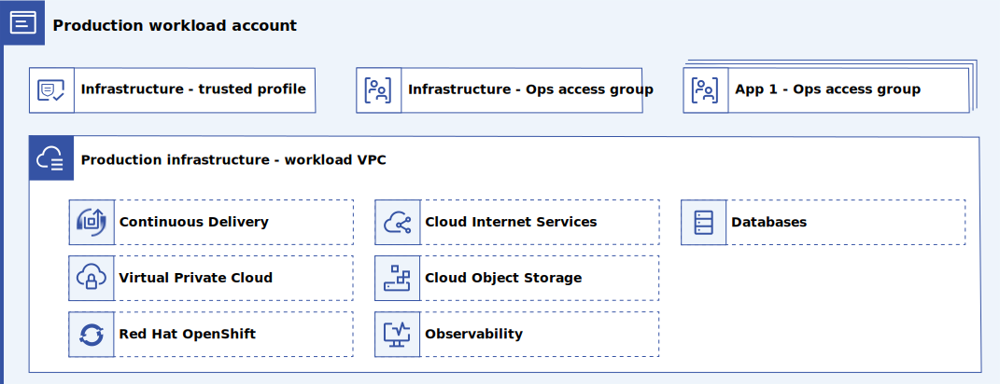
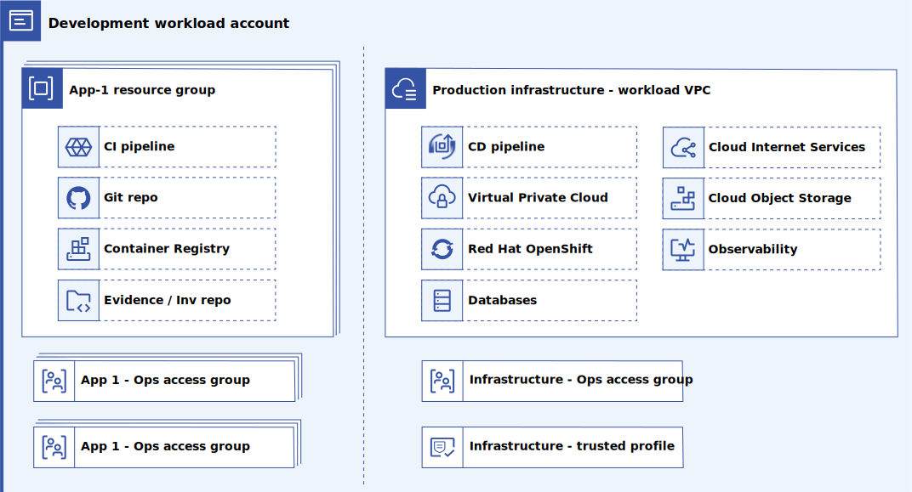

---

copyright:
  years: 2023
lastupdated: "2023-03-30"

subcollection: enterprise-account-architecture

keywords:

---

{{site.data.keyword.attribute-definition-list}}

# Workload accounts
{: #infra-account}

The workload accounts contain the shared application hosting infrastructure, including a VPC, Red Hat OpenShift on IBM Cloud cluster or virtual server instance, observability services, and more. This application hosting infrastructure should be selected from one of the compliant deployable architectures that are supported by IBM or a custom extension of such an architecture. A good example is the [VPC landing zone](https://cloud.ibm.com/catalog/architecture/deploy-arch-ibm-slz-vpc-9fc0fa64-27af-4fed-9dce-47b3640ba739-global){: external}, but others can be found in the [IBM Cloud catalog](https://cloud.ibm.com/catalog#reference_architecture){: external} and in the [IBM Cloud Framework for Financial Services](/docs/framework-financial-services?topic=framework-financial-services-reference-architecture-overview) documentation.

{: caption="Figure 1. Production workload account" caption-side="bottom"}

A single workload account contains a single VPC with one or more subnets, but a single address prefix. Limiting the number of VPCs and address prefixes is required to ensure that the transit gateway routing table size stays within limits as we scale the number of workload accounts.

The production workload account should be configured for limited user access. The primary user is a shared operations team that supports the infrastructure for all of the applications that run on it.

{: caption="Figure 2. Development workload account" caption-side="bottom"}

The development workload accounts contain the same shared application hosting infrastructure as the production workload account, although clusters can be scaled down to save cost. The development workload account also contains application development tools such as IBM Continuous Delivery Toolchains with their associated Git repos and CI/CD pipelines.

The development account is accessible to developers to trigger and monitor CI/CD pipeline runs, access Git repos, and monitor the development deployment through observability tools.

| Component | Quantity | Description |
|-----------|--------------|----|
| Workload VPC | 1 | Provides networking for this instance of shared infrastructure. Connects to the rest of the enterprise through the centralized transit gateway. Contains shared infrastructure components such as virtual servers and Red Hat OpenShift on IBM Cloud clusters |
| Application resource group | n | Contains application development infrastructure and services such as toolchains and evidence lockers. Only present in a development workload account. |
| Application trusted profile | n | Authorizes management of an application resource group by a project in the BU administration account. Only present in a development workload account. |
| Infrastructure Trusted Profile | 1 | Authorizes management of this account and the shared infrastructure by a project in the BU administration account. |
| Infrastructure operations access group | 1 | Access group to enable a BU DevOps team to monitor and manage the shared infrastructure |
| Application operations access group | n | Access groups to enable applications teams to operate their development tools and monitor their app |
{: caption="Table 1. Components" caption-side="bottom"}

## Rationale for shared application infrastructure
{: #rationale-shared}

Benefits of using shared application infrastructure:

- Less over-provisioning reduces cost

   Application hosting infrastructure must be sized to handle burst loads for an application. With a single application, it might be necessary to provision as much as 10x the steady state capability to handle bursts. However, when many applications are hosted in the cloud, the net load across many applications tends to smooth out as bursts rarely coincide. As a result, it might be necessary to only provision 10-50% extra capacity when you are hosting 10 or 20 applications thus providing considerable cost savings.

- Fixed cost elements can be shared across applications

   Application hosting infrastructure typically includes that certain resources can be considered a fixed cost per cluster or per VPC. Consolidating many applications onto the same infrastructure allows this cost to be spread across many applications for further cost savings.

- Operations savings

   Monitoring and maintaining an instance of application hosting infrastructure is approximately the same cost regardless of the size of that infrastructure. For example, maintaining a Kubernetes cluster is a fixed cost regardless of how many worker nodes it contains. Consolidating many applications onto the same infrastructure allows the cost of monitoring and maintaining infrastructure to be spread across many applications for operations savings.

## Other considerations
{: #other-considerations }

Consider the following items when you are using shared application infrastructure:

- Application isolation is not binary

   Applications can be network that is isolated but still share resources such as compute, RAM, and storage within a cluster. Policy around allocation of such shared resources must be considered with tradeoffs between cost and isolation in mind. For more information about network isolation, see [FS Cloud Boundary Protection](/docs/framework-financial-services?topic=framework-financial-services-best-practices#best-practices-boundary-protection).

- Not all application models can share infrastructure

   Shared application infrastructure makes sense only for sets of applications that have similar architectures. For example, sets of applications that use stateless microservices, containers, and managed database services can easily be deployed together. Other applications that are based on VM images with local storage will need separate application infrastructure. It is best practice to identify 2 or 3 common architectural patterns so that a small number of application hosting deployable architectures can be built and used for many applications.

- Interactions with centralized networking and services

   - Transit gateway

   Connecting the shared infrastructure VPC to the central transit gateway requires a process where both the centralized operations team and the BU operations team coordinate to connect the VPC.

   - Hyper Protect Crypto Services and other centralized services
  
     Authorizing the connection across accounts requires a process where both the centralized operations team and the BU operations team coordinate to create a service-to-service authorization for the consuming applications.
